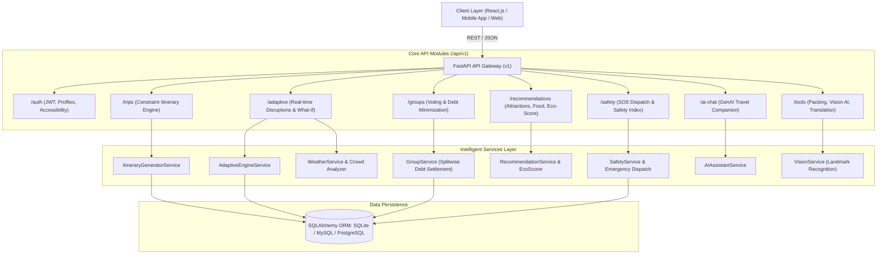

# 🧭 AI Adaptive Tourism Companion Backend

[](https://fastapi.tiangolo.com)
[](https://python.org)
[](https://sqlalchemy.org)
[](https://pydantic.dev)
[](LICENSE)

An intelligent, context-aware, real-time personalized travel planning backend built with **FastAPI**, **SQLAlchemy 2.0**, and **Pydantic v2**. 

Unlike conventional travel applications that offer rigid, static itineraries, the **AI Adaptive Tourism Companion** continuously monitors changing conditions—including **live weather shifts, crowd surges, traffic delays, attraction opening hours, and budget variances**—and dynamically adapts itineraries while preserving user accessibility and financial constraints.

---

## 🏛️ System Architecture



---

## ✨ Key Platform Features

### 1. 🎯 Personalized Multi-Demographic Trip Planning
- Tailored for **solo travelers, couples, families with children, college friend circles, and senior citizens**.
- Considers budget constraints, accessibility requirements (wheelchair access, minimal walking, audio assistance), travel pace (*relaxed*, *moderate*, *fast-paced*), and custom interests.
- Generates day-by-day itineraries pairing cultural landmarks with dietary-aligned local culinary spots.

### 2. ⚡ Real-Time Adaptive Itinerary Engine
- **Continuous Condition Monitoring**: Detects sudden weather shifts (heavy downpour, heatwaves), crowd surges, or budget deficits.
- **Dynamic Re-planning**: Automatically swaps outdoor venues for covered indoor cultural sanctuaries, replaces crowded bottlenecks with serene hidden gems, and preserves user constraints.
- **Audit Trail**: Every adjustment records the reason for the change, preserving the original activity reference.

### 3. 🔮 "What-If" Travel Simulator
- Preview hypothetical disruptions before they occur:
  - *"What if it pours rain on Day 2?"*
  - *"What if our travel budget is reduced by 25%?"*
  - *"What if our arrival flight is delayed by 3 hours?"*
- Computes schedule differences, financial variance, and sustainability changes without permanently altering active plans.

### 4. 👥 Collaborative Group Travel & Debt Minimization
- **Shared Budgeting**: Group trips with unique 8-character invite codes.
- **Democratic Proposal Voting**: Members cast up/down votes for activities, restaurants, and accommodations with consensus aggregation.
- **Automated Debt Simplification (Splitwise-style)**: Bilateral balance reconciliation algorithm that minimizes the number of cross-member settlement transactions.

### 5. 🌱 Eco-Tourism & Sustainability Scoring
- Carbon footprint estimations based on transit mode (*electric train*, *cycling*, *walking*, *bus*, *flight*).
- Eco-ratings (1.0 to 5.0) for attractions and green badges (*Gold Eco-Traveler*, *Silver Explorer*).

### 6. 🛡️ Tourist Safety Indicators & Emergency SOS
- Safety scoring and neighborhood risk indices (safe precincts vs. caution zones).
- Direct access to local emergency contacts (police, ambulance, tourist helpline, embassies).
- **One-Touch SOS Dispatch**: GPS coordinate broadcast, immediate safety guidelines, and nearest hospital routing.

### 7. 📸 Computer Vision Landmark Recognition & Audio Guides
- Identifies historic landmarks and monuments from uploaded photos.
- Delivers architectural breakdowns, historical context, visiting hours, and an immersive audio-guide narration script.

### 8. 💬 Conversational GenAI Companion & Smart Packing
- Natural language explanation of why activities were scheduled at particular times.
- Contextual packing checklists based on destination climate, planned activities, and traveler demographics.
- Multilingual translation with phonetic pronunciations and local cultural etiquette tips.

---

## 📁 Project Directory Structure

```
ai-adaptive-tourism-companion/
├── app/
│   ├── __init__.py
│   ├── main.py                          # FastAPI application factory & lifespan
│   ├── api/
│   │   ├── __init__.py
│   │   ├── deps.py                      # Dependencies (get_db, get_current_user)
│   │   └── v1/
│   │       ├── api.py                   # Aggregator router
│   │       └── endpoints/
│   │           ├── auth.py              # JWT Auth & Profile endpoints
│   │           ├── trips.py             # Trip creation & Itinerary engine
│   │           ├── adaptive.py          # Real-time adaptation & What-If simulator
│   │           ├── groups.py            # Group voting, shared budget & expense split
│   │           ├── recommendations.py   # Attractions, dining & eco-tourism
│   │           ├── safety.py            # Safety ratings & SOS emergency dispatch
│   │           ├── ai_chat.py           # GenAI conversational travel companion
│   │           └── tools.py             # Smart packing, landmark vision & translation
│   ├── core/
│   │   ├── config.py                    # Environment & Pydantic settings
│   │   ├── database.py                  # SQLAlchemy engine & session factory
│   │   └── security.py                  # Password hashing & JWT token handling
│   ├── models/                          # SQLAlchemy database models
│   │   ├── user.py                      # User model
│   │   ├── trip.py                      # Trip, ItineraryDay, Activity models
│   │   ├── group.py                     # GroupTrip, GroupMember, Expense, Vote models
│   │   ├── recommendation.py            # Attraction & FoodPlace models
│   │   └── safety.py                    # EmergencyContact & SafetyAlert models
│   ├── schemas/                         # Pydantic validation schemas
│   │   ├── user.py
│   │   ├── trip.py
│   │   ├── adaptive.py
│   │   ├── group.py
│   │   ├── recommendation.py
│   │   ├── safety.py
│   │   └── tools.py
│   └── services/                        # Business logic & AI algorithms
│       ├── itinerary_generator.py       # Personalized itinerary engine
│       ├── adaptive_engine.py           # Real-time disruptions & What-If simulator
│       ├── group_service.py             # Splitwise debt simplification & voting
│       ├── recommendation_service.py    # Attractions, food & eco scoring
│       ├── safety_service.py            # Safety index & SOS dispatcher
│       ├── ai_assistant_service.py      # GenAI explanations & smart packing
│       ├── vision_service.py            # Landmark recognition & audio guide
│       └── weather_service.py           # Weather forecasts & crowd estimation
├── tests/
│   ├── __init__.py
│   └── test_api.py                      # Automated test suite (Pytest)
├── .env.example                         # Sample environment configuration
├── .env                                 # Local environment file
├── requirements.txt                     # Dependencies
├── seed_data.py                         # Seeds Kyoto/Paris attractions & demo user
├── run.py                               # Server runner script
└── README.md                            # Comprehensive documentation
```

---

## 🚀 Quick Start Guide

### 1. Prerequisites
- Python 3.10+ (Tested up to Python 3.13)
- `pip` package manager

### 2. Setup Virtual Environment & Install Dependencies
```bash
# Clone or navigate to the project directory
cd ai-adaptive-tourism-companion

# Create virtual environment (optional but recommended)
python -m venv venv

# Activate virtual environment:
# On Windows (PowerShell):
.\venv\Scripts\Activate.ps1
# On macOS/Linux:
source venv/bin/activate

# Install dependencies
pip install -r requirements.txt
```

### 3. Seed Database with Initial Data
Run the seeding script to populate sample attractions in Kyoto and Paris, local food spots, and a demo traveler account (`traveler@example.com` / `travelpass123`):
```bash
python seed_data.py
```

### 4. Run the Backend Server
```bash
python run.py
```
Or with `uvicorn` directly:
```bash
uvicorn app.main:app --host 0.0.0.0 --port 8000 --reload
```

The server will be available at:
- **API Base URL**: `http://127.0.0.1:8000`
- **Interactive Swagger Documentation**: `http://127.0.0.1:8000/api/v1/docs`
- **ReDoc Documentation**: `http://127.0.0.1:8000/api/v1/redoc`

---

## 🧪 Running Automated Tests

Run the full end-to-end test suite using `pytest`:
```bash
pytest tests/test_api.py -v
```

---

## 📡 API Endpoint Overview

| Method | Endpoint | Description | Auth Required |
|:-------|:---------|:------------|:-------------:|
| **POST** | `/api/v1/auth/register` | Register a new traveler | ❌ |
| **POST** | `/api/v1/auth/login` | Login and obtain JWT token | ❌ |
| **GET** | `/api/v1/auth/me` | Get profile and personalized preferences | ✅ |
| **PUT** | `/api/v1/auth/preferences` | Update dietary, mobility, and pacing preferences | ✅ |
| **POST** | `/api/v1/trips/` | Create trip & generate AI itinerary | ✅ |
| **GET** | `/api/v1/trips/` | List traveler's trips | ✅ |
| **GET** | `/api/v1/trips/{id}` | Get full day-by-day trip details | ✅ |
| **POST** | `/api/v1/trips/{id}/regenerate` | Re-run recommendation generator | ✅ |
| **POST** | `/api/v1/adaptive/realtime-disruption` | Trigger live event (rain, crowd, budget deficit) | ✅ |
| **POST** | `/api/v1/adaptive/what-if` | Run What-If travel scenario simulation | ✅ |
| **GET** | `/api/v1/adaptive/weather/{destination}` | Get live weather & crowd forecast | ❌ |
| **POST** | `/api/v1/groups/create` | Initialize group trip with invite code | ✅ |
| **POST** | `/api/v1/groups/join` | Join group trip via invite code | ✅ |
| **POST** | `/api/v1/groups/expenses/{group_id}` | Add shared group expense | ✅ |
| **GET** | `/api/v1/groups/expenses/{group_id}/summary` | Debt settlement (who owes whom) | ✅ |
| **POST** | `/api/v1/groups/votes/{group_id}` | Vote on proposals (up/down) | ✅ |
| **GET** | `/api/v1/groups/consensus/{group_id}` | Group voting tallies & recommendations | ✅ |
| **GET** | `/api/v1/recommendations/attractions` | Filter attractions by accessibility & eco-rating | ❌ |
| **GET** | `/api/v1/recommendations/food` | Filter food by dietary needs (halal, vegan, etc.) | ❌ |
| **POST** | `/api/v1/recommendations/eco-evaluate` | Calculate trip carbon footprint & eco badge | ❌ |
| **GET** | `/api/v1/safety/index` | Destination safety score & risk areas | ❌ |
| **GET** | `/api/v1/safety/contacts` | Local emergency numbers & embassies | ❌ |
| **POST** | `/api/v1/safety/sos` | Trigger emergency SOS dispatch | ❌ |
| **POST** | `/api/v1/ai-chat/message` | Conversational GenAI travel advisor | ❌ |
| **POST** | `/api/v1/tools/smart-packing` | Climate & activity-aware packing checklist | ❌ |
| **POST** | `/api/v1/tools/landmark-recognition` | Computer vision landmark classification | ❌ |
| **POST** | `/api/v1/tools/translate` | Multilingual translation & local etiquette | ❌ |

---

## 💡 Frontend Integration Example

This backend is 100% compatible with React.js, Next.js, Vue, or mobile apps (React Native / Flutter).

```javascript
// Example: Creating a Trip with Itinerary Generation from React
const response = await fetch("http://localhost:8000/api/v1/trips/", {
  method: "POST",
  headers: {
    "Content-Type": "application/json",
    "Authorization": `Bearer ${token}`
  },
  body: JSON.stringify({
    title: "Kyoto Autumn Expedition",
    destination: "Kyoto, Japan",
    start_date: "2026-10-15T09:00:00",
    end_date: "2026-10-18T18:00:00",
    total_days: 3,
    budget: 1500.0,
    currency: "USD",
    group_type: "friends",
    group_size: 4,
    age_bracket: "20-30",
    accessibility_needs: [],
    interests: ["culture", "local_cuisine", "nature"],
    travel_pace: "moderate"
  })
});
const tripData = await response.json();
console.log("Generated Itinerary Days:", tripData.days);
```

---

## 📄 License
This project is open-source and available under the [MIT License](LICENSE).
